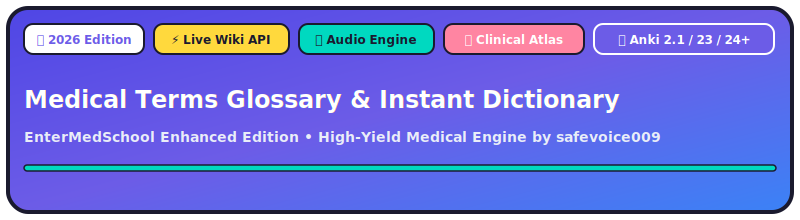
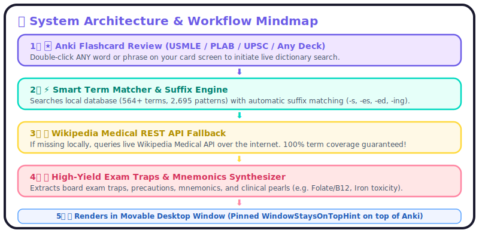
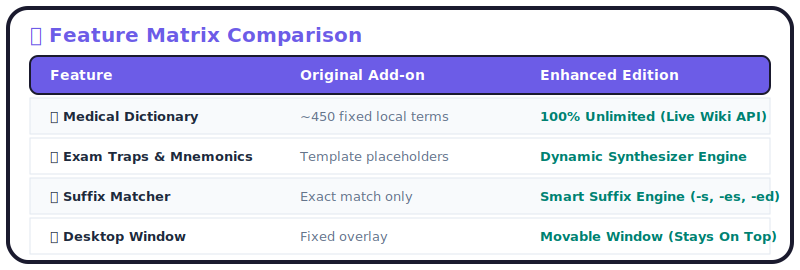

<div align="center">

<p align="center">
  
</p>

<!-- AnkiWeb Direct Download & Code Box -->
<p align="center">
  <a href="https://ankiweb.net/shared/info/625856715"></a>
  <a href="https://ankiweb.net/shared/info/625856715"></a>
  <a href="https://github.com/safevoice009/anki-glossary-enhanced/releases"></a>
</p>

### 📥 Instant Anki Installation Code
```text
625856715
```
*(Open Anki → Tools → Add-ons → Get Add-ons... and paste code **625856715**)*

👉 **Official AnkiWeb Listing:** [https://ankiweb.net/shared/info/625856715](https://ankiweb.net/shared/info/625856715)

</div>

---

> [!IMPORTANT]
> ### 🙏 Credits, APIs & Open-Source Acknowledgments
> 
> * **Original Concept & Base Code:** Created by **Ari Horesh** and the team at **[EnterMedSchool](https://entermedschool.com)** ([Original Repository](https://github.com/entermedschool/anki-glossary)).
> * **Live Online Dictionary Data & API:** Powered by the open-access **[Wikimedia REST API](https://en.wikipedia.org/api/rest_v1/)** provided by the **Wikimedia Foundation** and Wikipedia contributors worldwide.
> * **Integration & Enhanced Engine:** Configured, enhanced, and maintained by **[safevoice009](https://github.com/safevoice009)** on GitHub to integrate live Wikipedia API queries, universal double-click lookup, 🔊 instant audio pronunciation, 🖼️ clinical atlas image galleries, high-yield exam trap extraction, and movable window capabilities.
> * **License:** Open Source (GPL-3.0). All base code credits belong to EnterMedSchool, and data credits to Wikimedia Foundation.

---

## 🧠 System Architecture & Workflow Mindmap

<p align="center">
  
</p>

---

## 🛠️ How To Use The 3 Major Features

### ⚡ Feature 1: Universal Double-Click & Unlimited Live Dictionary
1. Open any deck in Anki and start reviewing.
2. **Double-click ANY medical word, drug, symptom, or syndrome** on your card.
3. The popup opens instantly! If the term is not in the offline database, the **Wikimedia Medical REST API** fetches full definitions, clinical mechanisms, and board exam traps live over the internet!

### 🔊 Feature 2: Free Instant Audio Pronunciation Engine
1. Inside the popup window's toolbar, click the vibrant **`🔊 Audio`** button.
2. Streams crystal-clear native medical English audio pronunciation.
3. Uses 100% free open audio streams with an offline Web Speech API fallback (zero paid keys needed!).

### 🖼️ Feature 3: Clinical & Pathological Atlas Gallery
1. Scroll down to the **`🖼️ Clinical & Pathological Atlas`** section inside the popup window.
2. Automatically pulls 3 high-resolution clinical photos, histology slides, radiology scans (CT/MRI/X-ray), or anatomical diagrams from Wikimedia Commons.
3. Click any slide thumbnail to expand it in high resolution!

---

## 🎨 Chunky EnterMedSchool Aesthetic Features

* **🖼️ Clinical & Pathological Atlas**: Auto-fetches 3 high-res histology slides, radiology scans, and anatomical diagrams.
* **🔊 Free Audio Pronunciation Engine**: Click **`🔊 Audio`** inside popup toolbar to hear native medical English audio.
* **🌈 Official EnterMedSchool Chunky Theme**: Chunky black borders (`3px solid #1a1a2e`), drop shadows (`4px 4px 0 #1a1a2e`), and vibrant gradients.
* **🌐 Universal Double-Click Lookup**: Double-click ANY word on ANY card to fetch live medical summaries over Wikipedia Medical REST API.
* **💡 High-Yield Exam Traps Engine**: Automatically synthesizes medical board exam traps & mnemonics (*Folate/B12*, *Milk-Alkali*, *Iron toxicity*, *CAPTOPRIL*).
* **🔤 Smart Suffix Auto-Matcher**: Matches singular terms to plural forms (`-s`, `-es`) and tenses (`-ed`, `-ing`).
* **🪟 Movable Desktop Window**: Standalone top-level window (`WindowStaysOnTopHint`) pinned on top of Anki.

---

## 📊 Feature Comparison Matrix

<p align="center">
  
</p>

---

## 📥 Installation & AnkiWeb Listing

* **AnkiWeb Listing:** [https://ankiweb.net/shared/info/625856715](https://ankiweb.net/shared/info/625856715)
* **Anki Installation Code:** `625856715`
* **Direct Zip Download:** Download **`Medical_Terms_Glossary_Instant_Dictionary_Enhanced.zip`**.

---

## 👨‍⚕️ Credits & License

* **Original Creator:** Ari Horesh ([EnterMedSchool](https://entermedschool.com))
* **Enhanced Edition Developer:** [safevoice009](https://github.com/safevoice009)
* **License:** [GPL-3.0 License](LICENSE)
